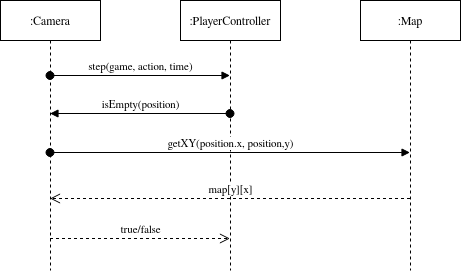
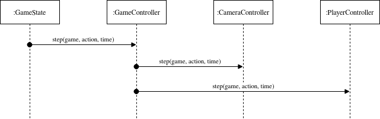
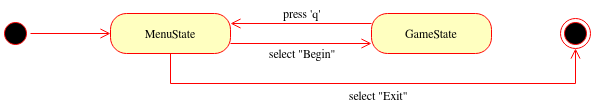
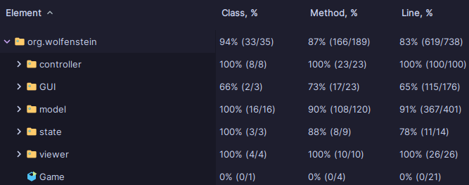
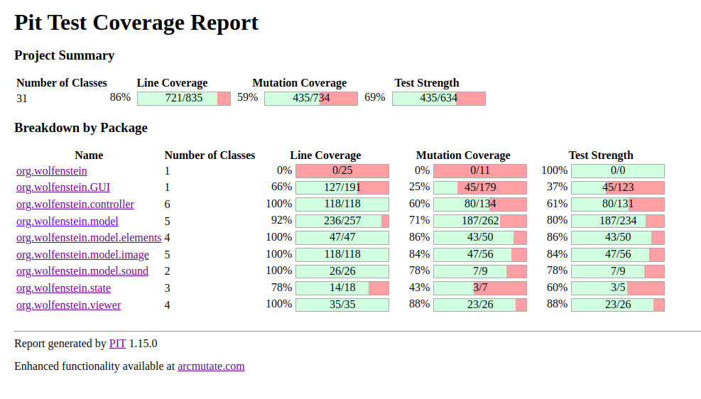

# LDTS_T1G06 - Wolfenstein Mock

> As the title states, this game is a mock version of Wolfenstein 3D, a game released in 1992 that is considered the
_grandfather of 3D shooters_.
> It was one of the first games that presented 3D graphics, using a raycasting engine to achieve that goal.
>

This project was developed by Henrique Fernandes, Rafael Magalhães and Ricardo Oliveira for LDTS 2023.

## Table of Contents

1. [Gameplay](#gameplay)
2. [Implemented features](#implemented-features)
3. [Design](#design)
4. [Testing](#testing-wip)
5. [Other information](#other-information)
6. [Self-evaluation](#self-evaluation)

---

## Gameplay

### Menu

    

### Moving

    

### Doors

    

### Shooting

    

> **Gameplay Controls:**
> - `w` to move forward / up in menu
> - `a` to rotate left
> - `s` to move backwards / down in menu
> - `d` to rotate right
> - `e` to open doors / select in menu
> - `space` to shoot
> - `q` to quit

> **Debug Controls:**
> - `p` to skip the level. Note that skipping the last level (the third) results in a crash.
> - `↑` increase health
> - `↓` decrease health
---

## IMPLEMENTED FEATURES

- **2D View** - The player has a top-down view of the map. The blue square is the starting tile, the green square is the
  end (and takes the player to the next map), yellow squares are doors and red squares are the initial positions of
  enemies.
- **3D View** - The game character has a 3D view based on _raycasting_.
- **Basic Lighting System** - The walls that are far away from the player are darker, while the ones that are near the
  player are brighter.
- **Collision System** - The player cannot go through walls and doors.
- **Sound effects** - Gunshot noises and other sound effects.
- **HUD** - HUD to visualize health and enemies remaining.
- **Enemies** - The game includes enemies that the player can kill. Each enemy requires 3 shots to be killed. The
  enemies can also shoot the player.
- **Doors** - The game is a sequence of rooms connected by doors to one another.
- **Multiple Levels** - The game features multiple levels, that can be altered using a .txt file that is located inside
  the resources folder. `X` is the delimiter of the map in the file, `0` means an empty square, `1` means a wall, `2` is
  the final position of the map, `3` is the starting position, `4` represents a door and `5` is an enemy.
- **Shooting** - The player possesses a gun to defeat the enemies.

---

## DESIGN

### _Raycasting_ Engine

The chosen algorithm for converting the 2D map to a 3D view is called _Raycasting_, which is the same algorithm as the
one used in the original _Wolfenstein_.

The process begins with the player's viewpoint on the 2D map. For each vertical column of pixels on the screen, a ray is
cast into the map from the player's position. As the ray travels, it checks for intersections with walls. The distance
to the first intersection is used to determine the apparent height of the wall on the screen. This information is then
used to render the 3D view, giving the player the perception of depth and distance.

Raycasting doesn't involve the complex 3D rendering techniques seen in modern games but rather simulates the effect
using clever calculations. Despite its simplicity, raycasting was a revolutionary approach in early game development and
played a crucial role in shaping the visual style of early first-person shooters.

---

### _Fisheye_ Effect

Since the distance to the walls is calculated in a straight line, the objects at the center are closer than objects on
the left/right, thus appearing bigger.  
This behavior can be corrected using simple trigonometry.

    

---

### Images, sounds and animations

The game has the ability to load images (in .png format), sounds (in .wav format) and animations (.png file containing a
sprite, that is, a sequence of frames).  
In order to achieve that, the game uses a loader class for each type of file. This makes the process of adding and
manipulating resources easier.

---

### Drawing the map and player view on the screen

**Problem in Context**

The game screen consists of two parts, the player's view and the map of the current level. However, drawing the player's
camera depends on the map, and drawing the map depends on the player. This is a violation of the DIP (Dependency
Inversion Principle).

**The Pattern**

The Factory Design Pattern can help us to avoid circular dependencies. By creating a class to act as an interface
between the player and map, both of these will depend on the interface, making the dependency non-circular.

**Implementation**

A class Camera (it was not named Screen to avoid confusion with the Lanterna Library) was created to act as an
interface between the Player and Map classes.
Example of the communication between classes when the Player moves:

    

**Consequences**

- The Player and Map classes were successfully isolated and no longer depend on each other.
- The Camera class allows for further extension to the screen if desired (for example to switch to the menu screen).
- Ensures simplicity for the client, who only needs to request screen drawing from the Camera class, instead of every
  single individual component.

---

### There can only be one player and one camera

**Problem in Context**

It may be necessary to access the Player or Camera classes from different locations of the program. It is important that
when we do, we access the instance of Player and Camera that are already running instead of new ones, so that
alterations may take effect.

**The Pattern**

The Singleton pattern will make it impossible to create more than one instance of a class, so it is perfect for this
problem.
This pattern is also used for accessing images, sounds and animations from anywhere in the code.

**Implementation**

The classes Player and Camera each have a private instance of itself and a private constructor to prevent the creation
of new instances. Thus, the singular instance is acquired by calling a separate function which returns the singular
private instance or calls the constructor if the instance does not exist yet.

**Consequences**

- The Player and Camera can now be accessed from any point of the program.
- The consistency of information in both classes is assured.

---

### Updating the screen

**Problem in Context**

The game functions by having a state that takes a step in every loop. It is necessary that every time this step occurs,
all the elements of the screen are updated.

**The Pattern**

The Observer pattern creates a mechanism to support these updates. By creating a many-to-one dependency a singular
update to a class can notify all the others they should update as well.

**Implementation**

Any controllers implemented (except for the menu controller) are observers of the GameController class. When this class
takes a step in the state, it calls all the other classes' step methods as well. The same happens for the viewers.
Sequence diagram of a step in the game loop:

    

**Consequences**

- If more elements are added to the game, their updates will be easy to implement.
- Although they have been aggregated, it is still possible to only notify some observers if desired.
- Ensures consistency controller and viewer-wise by forcing all step methods to be called "at the same time".

---

### Changing between menu and game

**Problem in context**

It is required for the player to be able to change between the menu and the actual game screen. So, we need a way to
distinguish which screen we are in as well as transition between screens.

**The Pattern**

The State pattern offers a solution to our problem by allowing an object to alter its behavior when the state changes.

**Implementation**

A State class was created with two derived classes MenuState and GameState, certain key presses allow to transition
between them and by having the current state saved in the game loop it is always possible to print the correct screen as
well as change to a new one.
State Diagram of the current game:

**Consequences**

- Menu and Game are now isolated.
- The addition of a different screen (e.g. Game Over) is extremely simple.

---

## TESTING

In order to achieve good functionality and reliability, we integrated a robust testing framework employing _JUnit_,
_Mockito_, _JQWIK_ and _PITEST_. These powerful tools enabled us to detect bugs without the need for exhaustive manual
testing.  
Not every aspect of the game is conducive to conventional testing methods, making complete coverage impractical or even irrelevant in certain cases. Similarly, in mutation testing, not all potential code mutations significantly contribute to the overall robustness of the code.

- Coverage report:

    

- _Pitest_ report:

    

---

## Other Information

### Known bugs

- There is a bug where sometimes it seems like the enemies are inside the wall, but that is only a display issue.

---

### Code smells

- Duplicated Code: There are some instances of duplicated code, however these are due to similar functions with small
  but key differences (e.g. createLine and createLineForDoor in the Position class).
- Long Functions: Some functions, such as drawPlayerCamera in the LanternaGUI class can be quite verbose. This is
  because doors and walls behave differently and the function is required to deal with both.
- Dead Code: Many fragments of dead code were present in the project. However, with the help of error-prone warnings
  these were eliminated.
- Message Chains: Some information requires navigation through the class structure to be accessed (e.g. getModel()
  .getPlayer().getPosition().moveForward() to get the position in front of the player from its controller). This was
  caused by the design chosen to make sure the Single Responsibility Principle was being fulfilled by the program.

---

## Conclusion and self-evaluation

Everyone played a key role in the development of the project. The work was distributed in a balanced way, which, together with _git_ and _github_, facilitated collaboration in order to develop the game in a smooth way.  

Building a game from scratch also deepened our respect for the developers of older games. They accomplished a lot with the limited tools and hardware they had, and still set the foundation for the game development industry.