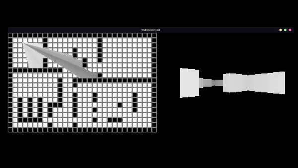

# LDTS_T1G06 - Wolfenstein Mock

> As the title states, this game is a mock version of Wolfenstein 3D, a game released in 1992 which is considered the
_grandfather of 3D shooters_.
> It was one of the first games that presented 3D graphics, using a raycasting engine to achieve that goal.
>

This project was developed by Henrique Fernandes, Rafael Magalhães and Ricardo Oliveira for LDTS 23/24.

## Table of Contents

1. [Gameplay](#gameplay)
2. [Implemented features](#implemented-features)
3. [Planned Features](#planned-features)
4. [Current Bugs](#current-bugs)
5. [Design](#design)

---

### Gameplay

    

> Use the arrows to move.  
> - Left arrow makes the player look to the left.  
> - Right arrow makes the player look to the right.  
> - Up arrow makes the player move forward.  
> - Down arrow makes the player move backward.

---

### IMPLEMENTED FEATURES

- **2D View** - The player has a top-down view of the map. This feature is going to be removed, since its only purpose
  is to test if the 3D view is correct.
- **3D View** - The game character has a 3D view based on _raycasting_.
- **Basic Lighting System** - The walls that are far away from the player are darker, while the one that are near the
  player are brighter.
- **Collision System** - The player cannot go through walls.

### PLANNED FEATURES

- **Multiple Rooms** - The overall game will be a sequence of rooms/levels connected by doors to one another.
- **Enemies** - The game will present different enemies with different behaviours.
- **Shooting** - The player will possess a gun and ammunition and my launch projectiles to defeat the enemy.
- **Health and Ammo Packs** - The player will be able to pick up packs in order to replenish his health and ammo.
- **Sound effects** - Soundtrack and/or sound effects (gunshot noises, footsteps, etc).
- **HUD** - HUD to visualize health and ammunition.

### Known Bugs

- _Fisheye_ effect when the player is looking to the north side of walls.
- The menu is too small due to the font size. For now, when the game opens the selected option is "Start" and the next
  option is "Exit".
- Due to the coordinates being stored as integers, depending on the angle the player might not move forward in the direction it is looking.
- In some instances, the player may continue moving even after releasing the key. This is caused by the way the input is handled.

---

### DESIGN

#### _Raycasting_ Engine

The chosen algorithm for converting the 2D map to a 3D view is called _Raycasting_, which is the same algorithm as the one used in the original _Wolfenstein_.

The process begins with the player's viewpoint in the 2D map. For each vertical column of pixels on the screen, a ray is cast into the map from the player's position. As the ray travels, it checks for intersections with walls. The distance to the first intersection is used to determine the apparent height of the wall on the screen. This information is then used to render the 3D view, giving the player the perception of depth and distance.

Raycasting doesn't involve the complex 3D rendering techniques seen in modern games but rather simulates the effect using clever calculations. Despite its simplicity, raycasting was a revolutionary approach in early game development and played a crucial role in shaping the visual style of early first-person shooters.

### _Fisheye_ Effect

Since the distance to the walls is calculated in a straight line, the objects at the center are closer than objects on the left/right, thus appearing bigger.  
This behaviour can be corrected using simple trigonometry.

    

#### DRAWING THE MAP AND PLAYER VIEW ON THE SCREEN

**Problem in Context**

The game screen consists of two parts, the player view and the map of the room he is in. However drawing the player
camera depends on the map and drawing the map depends on the player. This is a violation of the DIP(Dependency Inversion
Principle)

**The Pattern**

The Factory Design Pattern can help us to avoid the circular dependencies. By creating a class to act as an interface
between the player and map, both of these will depend on the interface, making the dependency non-circular.

**Implementation**

A class Camera (it was not named Screen to avoid confusion with the Lanterna Library) was created in order to act as an
interface between the Player and Map classes.

**Consequences**

- The Player and Map classes were successfully isolated and no longer depend on eachother.
- The Camera class allows for further extension to the screen if desired (for example to switch to the menu screen).
- Ensures simplicity for the client, who only needs to request screen drawing from the Camera class, instead of every
  sing individual component.

#### THERE CAN ONLY BE ONE PLAYER AND ONE CAMERA

**Problem in Context**

It may be necessary to access the Player or Camera classes from different locations of the program. It is important that when we do, we access the instance of Player and Camera that are already running instead of new ones, so that alterations may take effect.

**The Pattern**

The Singleton pattern will make it impossible to create more than one instance of a class, so it is perfect for this problem.

**Implementation**

The classes Player and Camera each have a private instance of itself and a private constructor to prevent the creation of new instances. Instead the singular instance is acquired by calling a separate function which returns the singular private instance, or calls the constructor if the instance does not exist yet.

**Consequences**

- The Player and Camera can now be accessed from any point of the program.
- The consistency of information in both classes is assured.

#### UPDATING THE SCREEN

**Problem in Context**

The game functions by having a state that takes a step every loop. It is necessary that every time this step occurs, all of the elements of the screen are updated.

**The Pattern**

The Observer pattern creates a mechanism to support these updates. By creating a many-to-one dependency a singular update to a class can notify all the others they should update as well.

**Implementation**

Any controllers implemented (except for the menu controller) are observers of the GameController class. When this class takes a step in state, it calls all the other classes' step methods as well. The same happens for the viewers.

**Consequences**

- If more elements are added to the game, their updates will be easy to implement.
- Although they have been aggregated, it is still possible to only notify some observers if desired.
- Ensures consistency controller and viewer-wise by forcing all step methods to be called "at the same time". 

#### KNOWN CODE SMELLS

We have not searched for code smells yet.

### TESTING

Testing?

### SELF-EVALUATION

- Henrique Fernandes: 33%
- Rafael Magalhães: 33%
- Ricardo Oliveira: 33%
